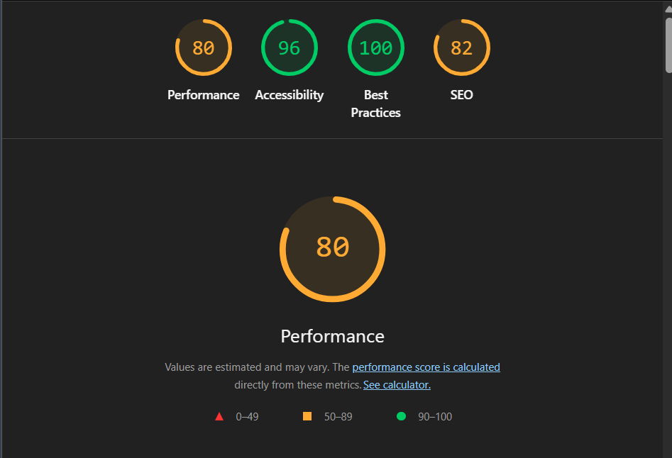

# 🗂️ TaskBoard — React Task Management Application

A feature-rich Kanban-style task management board built with React 18,
TypeScript, and Tailwind CSS. Demonstrates advanced React patterns,
performance optimizations, and complex state management.

---

## 🚀 Live Features

- **Kanban Board** — 3 columns (Todo, In Progress, Done)
- **Drag & Drop** — Move tasks between columns with smooth animations
- **Optimistic Updates** — Instant UI feedback with automatic rollback on failure
- **Real-time Simulation** — Simulates other users making changes every 10-15 seconds
- **Undo/Redo** — Full history stack with keyboard shortcuts
- **Advanced Filtering** — Search by title, description, tags, assignee, priority
- **Virtualization** — Handles 1000+ tasks efficiently
- **Error Boundaries** — Graceful error handling throughout the app
- **Dark Theme** — Fully dark UI with accessible color contrast

---

## 🛠️ Tech Stack

| Technology              | Version | Purpose              |
| ----------------------- | ------- | -------------------- |
| React                   | 18+     | UI Framework         |
| TypeScript              | 5+      | Type Safety          |
| Tailwind CSS            | 3       | Styling              |
| @dnd-kit/core           | latest  | Drag and Drop        |
| @tanstack/react-virtual | latest  | List Virtualization  |
| react-hot-toast         | latest  | Notifications        |
| @faker-js/faker         | latest  | Mock Data Generation |
| uuid                    | latest  | Unique ID Generation |
| Vite                    | latest  | Build Tool           |

---



## 📦 Getting Started

### Prerequisites

- Node.js 18+
- npm 9+

### Installation

```bash
# Clone the repository
git clone <your-repo-url>
cd task-board

# Install dependencies
npm install

# Start development server
npm run dev
Open http://localhost:5173 in your browser.

Build for Production
npm run build
npm run preview
📁 Project Structure
src/
├── types/
│   └── index.ts                  # All TypeScript interfaces and types
├── utils/
│   ├── taskGenerators.ts         # Mock data + task generation helpers
│   ├── simulateApi.ts            # API simulation with delay + failure rate
│   └── toastHelpers.ts           # Pre-styled toast notification helpers
├── context/
│   ├── TaskContextInstance.ts    # createContext() instance
│   ├── TaskContext.tsx           # TaskProvider component + reducers
│   └── useTaskContext.ts         # useTaskContext hook
├── hooks/
│   ├── useFilteredTasks.ts       # Memoized task filtering per column
│   ├── useOptimisticUpdate.ts    # Optimistic updates with rollback
│   └── useRealTimeSimulation.ts  # Real-time change simulation
└── components/
    ├── UI/
    │   ├── ErrorBoundary.tsx     # Error boundary with fallback UI
    │   └── Toast.tsx             # Global toast container
    ├── Filters/
    │   └── FilterBar.tsx         # Search + filter + undo/redo controls
    ├── Task/
    │   ├── TaskCard.tsx          # Individual task card (memoized)
    │   ├── TaskForm.tsx          # Create/edit task form with validation
    │   └── TaskModal.tsx         # Modal wrapper for TaskForm
    └── Board/
        ├── BoardColumn.tsx       # Kanban column with virtualization
        └── index.tsx             # Main board + DnD context
⌨️ Keyboard Shortcuts
Shortcut	Action
Ctrl + Z	Undo last action
Ctrl + Shift + Z	Redo last action
Ctrl + Y	Redo last action (alternative)
Alt + N	Open create task modal
Escape	Close modal
🏗️ Architecture Decisions
1. Context API + useReducer over Redux
Decision: Used React's built-in Context API with useReducer instead of Redux.

Reasoning:

App state complexity doesn't justify Redux overhead
useReducer gives the same predictable state updates
Fewer dependencies = faster install and simpler mental model
Context API is sufficient for this scale of application
2. Optimistic Updates Pattern
Decision: Update UI immediately before API confirms, rollback on failure.

Reasoning:

Users get instant feedback instead of waiting 2 seconds
90% of operations succeed so the optimistic state is usually correct
Rollback is transparent — users see a toast explaining what happened
isOptimistic: true flag provides visual feedback (pulsing animation)
Flow:

Save snapshot → Update UI → Call API → Success: done / Failure: restore snapshot
3. Undo/Redo via History Reducer
Decision: Wrapped taskReducer with a historyReducer that maintains past/present/future stacks.

Reasoning:

Clean separation — taskReducer handles data, historyReducer handles history
External updates (real-time simulation) intentionally skip history stack
Max 50 history entries prevents memory issues
Works seamlessly with optimistic updates
4. Virtualization per Column
Decision: Applied @tanstack/react-virtual to each column's task list.

Reasoning:

With 1000 tasks split across 3 columns, each column has ~333 tasks
Rendering 333 DOM nodes per column = ~1000 nodes total = very slow
Virtualization renders only ~10 visible cards per column at a time
Smooth scrolling maintained with overscan: 5
5. React Fast Refresh — File Separation
Decision: Split Context, hooks, and helper functions into separate files.

Reasoning:

React Fast Refresh requires each file to export only one type of thing
Components in .tsx files
Hooks in separate .ts files
Constants and utilities in separate .ts files
This also improves code organization and testability
6. Recursive setTimeout over setInterval
Decision: Used recursive setTimeout for real-time simulation instead of setInterval.

Reasoning:

setInterval can drift over time and pile up if callbacks are slow
setTimeout reschedules after each completion — no overlap possible
Easier to clean up on unmount
Random delay (10-15s) is recalculated each time for more realistic simulation
7. useRef for Simulation State
Decision: Used useRef to access latest tasks inside setTimeout callback.

Reasoning:

setTimeout creates a closure over the initial value of tasks
Without useRef, the simulation would always see the initial task list (stale closure)
useRef always points to latest value without causing re-renders
Avoids resetting the timer on every task update
⚡ Performance Optimizations
React.memo with Custom Comparison
// TaskCard only re-renders when its own task changes
export default memo(TaskCard, (prev, next) => {
  return (
    prev.task.updatedAt === next.task.updatedAt &&
    prev.task.isOptimistic === next.task.isOptimistic
  );
});
useMemo for Filtering
// Filtering only runs when tasks or filters change
return useMemo(() => {
  return tasks.filter(task => { /* filter logic */ });
}, [tasks, filters, status]);
Virtualization
// Only renders visible cards + 5 overscan items
const virtualizer = useVirtualizer({
  count: tasks.length,
  getScrollElement: () => scrollContainerRef.current,
  estimateSize: () => 180,
  overscan: 5,
});
useCallback for Stable References
// Stable function references prevent child re-renders
const handleEdit = useCallback((task: Task) => onEditTask(task), [onEditTask]);
🔄 State Management Flow
User Action (drag, click, type)
          ↓
    dispatch(action)
          ↓
  historyReducer
  ├── UNDO → restore from past stack
  ├── REDO → restore from future stack
  ├── APPLY_EXTERNAL_UPDATE → skip history
  └── everything else → push to past, call taskReducer
          ↓
    taskReducer
  ├── ADD_TASK
  ├── UPDATE_TASK
  ├── ROLLBACK_TASK
  ├── DELETE_TASK
  └── APPLY_EXTERNAL_UPDATE
          ↓
  New state flows to all components
🎯 Assignment Requirements Coverage
Part 1 — Core Functionality ✅
 Task display with all required fields
 3 column kanban board
 Drag and drop between columns
 Task creation modal with validation
 Filter by assignee, priority, search
Part 2 — Advanced Features ✅
 Optimistic updates with 2s delay simulation
 10% random failure rate with rollback
 Loading states during updates
 Real-time simulation every 10-15 seconds
 Toast notifications for external changes
 Virtualization for 1000+ tasks
 Memoized computations
 Error boundaries
Part 3 — Expert Challenge ✅ (Option A)
 Undo/Redo system
 Keyboard shortcuts (Ctrl+Z, Ctrl+Shift+Z)
 Max 50 history entries
 Works with optimistic updates
 Undo/Redo buttons in UI with disabled states
Bonus Features ✅
 TypeScript throughout
 Dark mode UI
 Responsive design
 Accessibility (aria labels, keyboard navigation)
 Clean component structure
 Custom hooks for reusable logic
🧪 Key Assumptions & Decisions
No persistence — State resets on page refresh. In production this would use a backend API or localStorage.

Mock data — 25 pre-defined tasks from the assignment spec are loaded on startup. Additional tasks can be generated for performance testing.

10% failure rate — Kept at exactly 10% as specified. In production this would be 0% with real error handling for actual network failures.

Conflict resolution — When a real-time simulation update arrives for a task that has a pending optimistic update (isOptimistic: true), the external update is skipped to avoid conflicts. The simulation filters out optimistic tasks.

Drag and drop + virtualization — These two technologies can conflict since virtualized items aren't all in the DOM. @dnd-kit handles this better than react-beautiful-dnd due to its pointer-based model which doesn't require all items to be mounted.

Column type — Removed the Column interface import from Board since columns are defined inline with as Status casting for simplicity.

👨‍💻 Author
Built as part of a React technical assessment demonstrating:

Advanced React patterns (hooks, context, reducers)
Performance optimization techniques
TypeScript best practices
Complex state management
Real-world UX considerations
```
